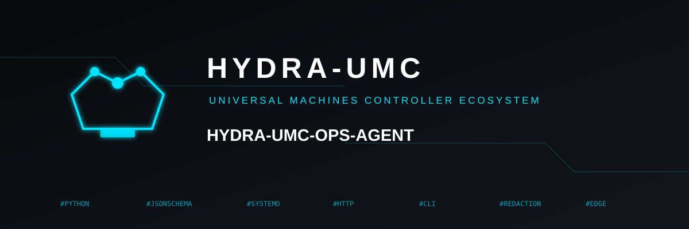

<p align="center">
  
</p>

# 🩺 HYDRA-UMC-OPS-AGENT

<p align="center"><a href="README.md">🇺🇸 English</a> | 🇪🇸 <b>Español</b> | <a href="README_fra.md">🇫🇷 Français</a> | <a href="README_ita.md">🇮🇹 Italiano</a> | <a href="README_deu.md">🇩🇪 Deutsch</a> | <a href="README_zho.md">🇨🇳 简体中文</a> | <a href="README_jpn.md">🇯🇵 日本語</a></p>

### 🔎 Observabilidad de incidencias de mantenimiento, de solo lectura, para todo el ecosistema

<p align="center">
  
  
  
  
</p>

> **Estado: v0.0.8, scaffolding - Entregas 1-5 de 6 (evidencia,
> diagnóstico, cambio aprobado por una persona, despliegue canario,
> verificación).** Cada subcomando es real y está probado de extremo a
> extremo - `control diagnose` contra un proveedor de IA simulado
> (cualquier proveedor real funciona, ver
> [docs/DIAGNOSIS.md](docs/DIAGNOSIS.md)); `control deploy-canary`
> contra un repositorio git local real y desechable (ver
> [docs/CHANGE_LIFECYCLE.md](docs/CHANGE_LIFECYCLE.md)). Nada se
> despliega nunca sin una aprobación humana explícita antes. La Entrega
> 6 (voz/notificaciones) fue investigada y resultó estar realmente
> bloqueada, no simplemente pospuesta - ver la sección HOJA DE RUTA más
> abajo. Ver [docs/CLI_REFERENCE.md](docs/CLI_REFERENCE.md) para la
> superficie de comandos exacta que existe hoy.

---

## 1. 🛠️ VISIÓN TÉCNICA

HYDRA-UMC-OPS-AGENT es el coordinador de incidencias de mantenimiento
del ecosistema HYDRA-UMC/URTC. Es dueño de un único ciclo de vida real -
**evidencia → diagnóstico → cambio aprobado por una persona → despliegue
canario vía HYDRA-UMC-UPDATER → verificación** - sin reimplementar la
inferencia, las actualizaciones ni la lógica de seguridad del MCU que ya
existen en otras partes del ecosistema. Este proyecto ya envía cinco de
las seis etapas de ese ciclo de vida: **la evidencia**, **el
diagnóstico**, **el cambio aprobado por una persona**, **el despliegue
canario** y **la verificación**.

Dos roles, un solo paquete, todavía sin transporte de red entre ellos:

1. **Rol edge** (`edge collect`) - se ejecuta directamente en la máquina
   observada (una célula CM5 real, o la propia estación de trabajo de
   un desarrollador). Escanea cada checkout hermano en busca de su
   propio `hydra-umc.project.json`, opcionalmente comprueba una o más
   unidades systemd y endpoints HTTP de salud, y deriva una
   `MaintenanceIncident` real por cada problema REAL que encuentra - un
   escaneo limpio produce cero incidencias, nunca una "todo OK"
   sintética. Todas las incidencias de la misma ejecución comparten un
   único ID de correlación.
2. **Rol control-plane** (`control show`) - se ejecuta en una máquina de
   desarrollo y renderiza un archivo de snapshot guardado, de solo
   lectura: inventario de proyectos, resultados de comprobaciones de
   salud, y todas las incidencias ordenadas de más a menos graves. Nunca
   modifica el archivo que lee, y esta entrega tampoco "resuelve" ni
   reconoce ninguna incidencia desde aquí.
3. **Diagnóstico** (`control diagnose`) - también se ejecuta en el rol
   control-plane. Envía una incidencia ya redactada a un proveedor de
   IA (cualquier proveedor - Anthropic y OpenAI vienen integrados de
   serie, ver [docs/DIAGNOSIS.md](docs/DIAGNOSIS.md)) y obtiene de
   vuelta una explicación de causa raíz propuesta en texto plano - una
   sugerencia para que la lea una persona, nunca una decisión.
4. **Cambio aprobado por una persona** (`control propose` / `approve` /
   `reject`) - un `ChangeProposal` real e inmutable (un diff unificado,
   una descripción, una justificación) que transita de `pending` a
   `approved`/`rejected` EXACTAMENTE UNA VEZ, siempre atribuido a una
   persona real con nombre. Ver
   [docs/CHANGE_LIFECYCLE.md](docs/CHANGE_LIFECYCLE.md).
5. **Despliegue canario** (`control deploy-canary`) - se niega a
   ejecutarse contra nada que no sea una propuesta `approved`. Aplica el
   diff a un clon de staging independiente, ejecuta el propio comando
   real de build-test del proyecto objetivo ahí, y solo promueve
   (guardando el checkout anterior como copia de seguridad real) si eso
   pasa - el checkout real nunca se toca en ningún otro caso.
6. **Verificación** (`control verify`) - vuelve a ejecutar la
   comprobación real exacta que originalmente produjo una incidencia,
   usando las propias funciones de la Entrega 1, para confirmar que
   está de verdad resuelta.

```
$ hydra-umc-ops-agent edge collect \
    --node-name cm5-cell-3 --projects-root /home/pi/HYDRA-UMC \
    --systemd-unit hydra-umc-server.service \
    --http-health-url http://127.0.0.1:8090/health \
    --out snapshot.json
Wrote snapshot to snapshot.json (1 incident(s)).

$ hydra-umc-ops-agent control show snapshot.json
Node: cm5-cell-3   Collected: 2026-09-06T10:15:03Z   Correlation: 7c2c...
Projects scanned: 27
Incidents: 1
  [CRITICAL] hydra-umc-server.service - systemd unit is not active

$ ANTHROPIC_API_KEY=sk-ant-... hydra-umc-ops-agent control diagnose \
    snapshot.json --incident-id 7c2c1e4a-...
{
  "incidentId": "7c2c1e4a-...",
  "explanation": "Likely cause: the service crashed on startup...",
  "disclaimer": "This is an AI-generated suggestion, not a decision. ..."
}

$ hydra-umc-ops-agent control propose snapshot.json --incident-id 7c2c1e4a-... \
    --project-name HYDRA-UMC-SERVER --description "Increase retry count to 3" \
    --diff-file fix.diff --rationale "gives up too early" --out proposal.json
$ hydra-umc-ops-agent control approve proposal.json --approved-by "Juan Enrique"
$ hydra-umc-ops-agent control deploy-canary proposal.json \
    --live-root /home/pi/HYDRA-UMC/HYDRA-UMC-SERVER --build-test-command "bash build-test.sh"
$ hydra-umc-ops-agent control verify snapshot.json --incident-id 7c2c1e4a-...
```

Ver [docs/CHANGE_LIFECYCLE.md](docs/CHANGE_LIFECYCLE.md) para el flujo
completo y real de operador de arriba.

En esta entrega no existe ninguna invocación por defecto/sin argumentos
ni GUI - ver [docs/CLI_REFERENCE.md](docs/CLI_REFERENCE.md) para la
superficie de comandos completa y real.

## 2. 🧱 ARQUITECTURA Y DECISIONES DE DISEÑO

- **Una incidencia se deriva, nunca se declara.** Los métodos `add_*` de
  `IncidentBatch` devuelven `None` cuando lo examinado resultó estar
  sano. No hay ningún camino de código que fabrique una incidencia a
  partir de una observación limpia, ni ninguno que descarte
  silenciosamente una real.
- **Un límite de protocolo se degrada con honestidad, nunca adivina.**
  `check_systemd_unit_health()` lanza un `SystemdUnavailableError`
  propio en el instante en que `systemctl` no está en `PATH` - lo cual
  ocurre siempre en esta máquina de desarrollo, y en cualquier host sin
  systemd - en vez de reportar un estado "inactive" inventado.
  `check_http_health()` mantiene un fallo de red real (`status_code is
  None`) distinguible de una respuesta HTTP real pero no saludable.
- **La redacción es la pieza de código más crítica para la seguridad
  aquí.** `log_redaction.py` es una transformación de texto pura y sin
  dependencias, cubierta por sus propios tests antes de que nada más la
  consuma. Una coincidencia de nombre de clave tiene que buscar el
  nombre del secreto como subcadena dentro de un token identificador
  real (`DB_PASSWORD`, `api-key`), no como una palabra delimitada por
  `\b` - `_` es un carácter de palabra en una expresión regular, así que
  un `\bpassword\b` ingenuo nunca coincide con `DB_PASSWORD`.
  `MaintenanceIncident.to_dict()` vuelve a ejecutar `redact_secrets()`
  sobre `symptom` en el momento de la serialización, aunque quien la
  llama ya la haya redactado antes - defensa en profundidad para el
  campo con más probabilidad de llevar una línea de log copiada y
  pegada.
- **El contrato `MaintenanceIncident`/`NodeSnapshot` está fijado a
  propósito, campo a campo, a un "CONTRATO MINIMO" explícito.**
  Ver [docs/INCIDENT_CONTRACT.md](docs/INCIDENT_CONTRACT.md). Una
  entrega futura que hable con un proveedor de IA real o un sistema de
  tickets nunca debería tener que traducir entre dos formas
  incompatibles.
- **El diagnóstico es independiente del proveedor por diseño.**
  `diagnose_incident()` depende solo de un Protocol mínimo `AIProvider`
  - nunca se fija en código un proveedor de IA concreto. Anthropic y
  OpenAI vienen como extras opcionales reales; cualquier llamador puede
  pasar otro objeto que implemente ese mismo contrato de un solo método.
- **Un despliegue canario nunca toca el checkout real hasta que un build
  real ya demostró que el cambio funciona.** `deploy_canary()` se niega
  a ejecutarse a menos que la propuesta dada tenga `status` `approved`,
  luego pone en staging el diff en un clon local independiente y solo
  promueve (intercambio de dos renombrados, checkout anterior guardado
  como copia real) si el propio comando de build-test de ese proyecto
  de verdad termina con código `0` - el mismo patrón
  atómico-por-verificación que ya usa el propio `install.py` de
  HYDRA-UMC-UPDATER.
- **Una propuesta se decide exactamente una vez.**
  `approve_change()`/`reject_change()` lanzan `InvalidTransitionError`
  ante cualquier cosa que no sea una propuesta `pending` - una segunda
  decisión nunca sobrescribe silenciosamente la primera, y cada decisión
  se atribuye a un nombre real, no vacío.
- **La verificación vuelve a ejecutar la MISMA comprobación real, nunca
  una más laxa.** `verify_incident_resolved()` llama directamente a las
  propias `check_http_health()`/`check_systemd_unit_health()` de la
  Entrega 1 - no existe una segunda implementación de comprobación de
  salud, independiente y propensa a desviarse, en ningún lugar de este
  proyecto.
- **La Entrega 6 está bloqueada, no simplemente omitida.** El propio
  contrato real de HYDRA-UMC-VOICE-UI (`gateway.py`) es una puerta de
  entrada acotada, de ENTRADA, de transcripción a intención, sin ninguna
  superficie real de notificación de salida hoy - inventar una aquí
  habría significado fabricar una integración que no existe, algo que
  el propio estándar de no fabricar de este proyecto no permite. Ver la
  sección HOJA DE RUTA más abajo.
- **Solo librería estándar para el núcleo.** `edge collect`/`control
  show`/`control propose`/`control approve`/`control reject`/`control
  verify` no necesitan ninguna dependencia - `urllib.request` para la
  comprobación HTTP, `subprocess`/`shutil.which` para la de systemd,
  `git` (un binario externo real, no un paquete Python) para la etapa de
  despliegue canario. Solo `control diagnose` necesita un extra
  opcional, y solo para el proveedor realmente usado.

## 📂 ESTRUCTURA DE DIRECTORIOS

```
HYDRA-UMC-OPS-AGENT/
├── src/hydra_umc_ops_agent/
│   ├── log_redaction.py    # Redacción pura de secretos (KEY=VALUE, tokens Bearer, bloques PEM)
│   ├── inventory.py        # Escaneo de manifiestos + comprobaciones de salud systemd/HTTP
│   ├── incident.py         # Contrato MaintenanceIncident / IncidentBatch
│   ├── edge_agent.py       # Orquesta lo anterior en un único NodeSnapshot
│   ├── control_plane.py    # Cargador de snapshot de solo lectura + renderizador de informe de texto
│   ├── diagnosis.py        # Entrega 2: sugerencia de diagnóstico asistida por IA, independiente del proveedor
│   ├── change_proposal.py  # Entrega 3: ciclo de vida inmutable de ChangeProposal, aprobado por una persona
│   ├── canary_deploy.py    # Entrega 4: stage + apply + verify + promote, solo con aprobación
│   ├── verification.py     # Entrega 5: vuelve a ejecutar la comprobación real detrás de una incidencia
│   └── cli.py               # Punto de entrada de subcomandos edge/control para cada entrega de arriba
├── tests/                  # Tests reales para los 10 módulos, incl. un fixture local http.server, un proveedor de IA simulado y un repo git real y desechable para el despliegue canario
├── docs/
│   ├── CLI_REFERENCE.md     # Cada subcomando, sus flags, el contrato de códigos de salida
│   ├── INCIDENT_CONTRACT.md # La forma JSON real de MaintenanceIncident/NodeSnapshot
│   ├── DIAGNOSIS.md         # El contrato, proveedores y límite de seguridad propios de la Entrega 2
│   └── CHANGE_LIFECYCLE.md  # El contrato y límite de seguridad propios de las Entregas 3-5
├── images/                 # Medios e iconos de la app
├── tools/
│   ├── build_test.py        # Comprobación de build/compilación sin versionado
│   └── ci_validate.py       # Validación de manifiesto/CHANGELOG/docs usada por la CI
├── build.sh / build.bat     # venv + instalación editable + compile-check + tests
├── build-test.sh / .bat     # Solo validación de build, sin mutar nada
├── run.sh / run.bat         # Demo real de edge collect + control show (sin argumentos), o reenvía un comando CLI real
├── bump_version.py          # Incremento tipo "odómetro" del ecosistema (pyproject.toml + __init__.py)
└── bump_manifest_version.py # Sincroniza la versión de hydra-umc.project.json con la nativa (--sync)
```

## ⚙️ COMPILACIÓN Y EJECUCIÓN

```bash
chmod +x build.sh   # una sola vez
./build.sh          # crea .venv, pip install -e ".[dev]", compile-check + tests
./run.sh                                          # demo real: edge collect contra este
                                                   # workspace de GitHub, luego control show
./run.sh edge collect --node-name n --projects-root DIR --out FILE
./run.sh control show snapshot.json
pip install -e ".[ai-anthropic]"                  # o .[ai-openai] - solo necesario para control diagnose
ANTHROPIC_API_KEY=sk-ant-... ./run.sh control diagnose snapshot.json --incident-id <id>
./run.sh control propose snapshot.json --incident-id <id> --project-name NOMBRE --description "..." --diff-file fix.diff --rationale "..." --out proposal.json
./run.sh control approve proposal.json --approved-by "Tu Nombre"
./run.sh control deploy-canary proposal.json --live-root RUTA --build-test-command "bash build-test.sh"
./run.sh control verify snapshot.json --incident-id <id>
```

En Windows: `build.bat`, y luego `run.bat` (misma demo si se llama sin
argumentos) / `run.bat edge collect ...` / cualquiera de los
subcomandos `control ...` de arriba. `build-test.sh`/`.bat` realiza la
misma comprobación de compilación (solo sintaxis Python), sin mutar
nada, que la propia CI de este proyecto realiza - NO ejecuta la
suite de tests por sí solo; la CI ejecuta `pytest` como un paso
separado, posterior. Ejecuta `./build.sh`/`build.bat` (o `pytest
tests/` directamente) para la suite de tests completa en local.

**Solución de problemas**

- `edge collect` reporta `systemdAvailable: false` en cada ejecución:
  este host de verdad no tiene `systemctl` en `PATH` (toda máquina de
  desarrollo que no sea Linux, y algunos contenedores Linux mínimos) -
  es la degradación honesta esperada, no un fallo. Ver
  [docs/CLI_REFERENCE.md](docs/CLI_REFERENCE.md).
- `control show` falla con `ERROR: ...`: el archivo de snapshot no
  existe, no es JSON válido, o no es un objeto de snapshot real -
  vuelve a ejecutar `edge collect` y revisa su propia ruta `--out`.
- `control diagnose` falla con `ERROR: the optional '<provider>' package
  is not installed`: ejecuta `pip install -e ".[ai-anthropic]"` o
  `".[ai-openai]"`, según `--provider`.
- `control diagnose` falla con `ERROR: no ... API key available`: define
  `ANTHROPIC_API_KEY`/`OPENAI_API_KEY` antes de ejecutarlo.
- `control deploy-canary` falla con `ERROR: refusing to deploy ...`: la
  propuesta todavía no está `approved` - ejecuta primero `control
  approve`.
- `control deploy-canary` reporta `promoted: false`: lee `buildOutput`
  en el JSON de resultado - el build de staging falló de verdad, y el
  checkout real nunca se tocó. Ver
  [docs/CHANGE_LIFECYCLE.md](docs/CHANGE_LIFECYCLE.md).

## 🚀 HOJA DE RUTA

Las Entregas 1-5 (esta versión) envían **evidencia**, **diagnóstico**,
**cambio aprobado por una persona**, **despliegue canario** y
**verificación** - el ciclo de vida real ya nombrado en el propio
manifiesto y CHANGELOG de este proyecto. Lo que queda:

- **Entrega 6 - Integración de voz/notificaciones - de verdad
  BLOQUEADA, no simplemente pospuesta.** El plan era mostrar una
  incidencia crítica, o un canario completado, a través de
  HYDRA-UMC-VOICE-UI. La investigación real de su propio código
  (`gateway.py`) encontró que es una puerta de entrada acotada, de
  ENTRADA, de transcripción a intención (un Watch envía texto, recibe
  una respuesta), sin ninguna superficie real de notificación de salida
  hoy. Construir una aquí habría significado inventar un punto de
  integración que VOICE-UI mismo no tiene - el propio estándar de no
  fabricar de este proyecto no lo permite. Revisitar esto en cuanto
  VOICE-UI (o un sucesor) desarrolle una capacidad real propia de
  "anuncio entrante del asistente".
- Un transporte real entre los roles edge y control-plane (hoy, mover un
  archivo de snapshot entre ambos es un paso manual).
- Un comando de rollback para un canario ya promovido que después
  resulta estar mal en producción - el directorio `.backup-<id>` es
  real y se conserva, pero restaurarlo hoy es un paso manual (ver
  [docs/CHANGE_LIFECYCLE.md](docs/CHANGE_LIFECYCLE.md)).

## 🔗 Proyectos Relacionados

Este proyecto forma parte del ecosistema robótico HYDRA-UMC del mismo autor (JuanenRac / Electro Hobby 3D). Vale la pena conocerlo, ya que una petición podría en realidad tratarse de uno de estos en vez de este repositorio.

**Directamente Relacionados**
- **[HYDRA-UMC-UPDATER](https://github.com/JuanenRac/HYDRA-UMC-UPDATER)** — detecta, instala y actualiza cada checkout del ecosistema; un despliegue canario de la Entrega 4 aplica un cambio aprobado a través de la propia ruta de actualización atómica-por-verificación ya existente de este proyecto, en vez de una segunda implementación.
- **[HYDRA-UMC-OS-REBUILDER](https://github.com/JuanenRac/HYDRA-UMC-OS-REBUILDER)** — otro hermano de "Ecosystem Operations": construye una imagen de CM5 nueva y totalmente actualizada, en vez de observar una que ya está en marcha.
- **[HYDRA-UMC-DEV-SERVER](https://github.com/JuanenRac/HYDRA-UMC-DEV-SERVER)** — host de desarrollo reproducible que compila candidatos y coordina su cola de tareas duradera con el propio ciclo de vida de incidencias de este proyecto; nunca aprueba sus propias tareas.
- **[HYDRA-UMC-NODE-HEALING](https://github.com/JuanenRac/HYDRA-UMC-NODE-HEALING)** — un vigilante de salud de flota real basado en gRPC, con su propio retry/backoff y detección de discrepancia de identidad - un tema relacionado pero distinto (salud de nodos de flota en vivo vía gRPC) de la propia recopilación de evidencia por manifiesto/systemd/HTTP y del ciclo de vida de incidencias de este proyecto.

**También Forma Parte del Ecosistema**

*Hardware Central y Plataforma*
- **[HYDRA-UMC](https://github.com/JuanenRac/HYDRA-UMC)** — la placa base física del brazo robótico: host CM5 + STM32H745 dual-core, orquestando hasta 8 brazos-herramienta vía CAN-OTA/SPI-OTA.
- **[HYDRA-UMC-OS](https://github.com/JuanenRac/HYDRA-UMC-OS)** — capa de producto Raspberry Pi OS reproducible para la CM5: agente de solo lectura, configuración/perfiles validados, aprovisionamiento WiFi de primer contacto.
- **[HYDRA-UMC-SDK](https://github.com/JuanenRac/HYDRA-UMC-SDK)** — el contrato JSON-Schema compartido y el límite de puerta de seguridad contra el que valida sus comandos cada bridge.

*Backend y Clientes Centrales*
- **[HYDRA-UMC-SERVER](https://github.com/JuanenRac/HYDRA-UMC-SERVER)** — el backend real sin interfaz (REST/WebSocket) con el que de verdad habla cada cliente de control.
- **[HYDRA-UMC-STUDIO](https://github.com/JuanenRac/HYDRA-UMC-STUDIO)** — panel de control web con visualización 3D multi-robot en tiempo real.
- **[HYDRA-UMC-SUITE](https://github.com/JuanenRac/HYDRA-UMC-SUITE)** — centro de mando de escritorio (PySide6) para varios servidores a la vez.
- **[HYDRA-UMC-ANDROID-CONTROL](https://github.com/JuanenRac/HYDRA-UMC-ANDROID-CONTROL)** — app de control Android nativa con inicio de sesión biométrico y un compañero Wear OS emparejado.
- **[HYDRA-UMC-IOS-CONTROL](https://github.com/JuanenRac/HYDRA-UMC-IOS-CONTROL)** — app de control iOS/iPadOS (Flutter) con sincronización WebSocket en tiempo real.
- **[HYDRA-UMC-DSI](https://github.com/JuanenRac/HYDRA-UMC-DSI)** — interfaz táctil nativa para la pantalla DSI de 7" integrada, embebida en la propia CM5.
- **[HYDRA-UMC-EDITOR-URDF](https://github.com/JuanenRac/HYDRA-UMC-EDITOR-URDF)** — creador/editor gráfico de escritorio de URDF que envía los modelos terminados al propio catálogo de STUDIO.
- **[HYDRA-UMC-BRIDGE-AMR](https://github.com/JuanenRac/HYDRA-UMC-BRIDGE-AMR)** — límite de coordinación para flotas AGV/AMR vía un publicador MQTT VDA 5050 real.
- **[HYDRA-UMC-BRIDGE-CNC](https://github.com/JuanenRac/HYDRA-UMC-BRIDGE-CNC)** — coordinador de célula CNC de alto nivel con acceso real a estado/byte de control GRBL.
- **[HYDRA-UMC-BRIDGE-DROIDS](https://github.com/JuanenRac/HYDRA-UMC-BRIDGE-DROIDS)** — límite de coordinación para droides con patas/humanoides, con un emisor de comandos real para Boston Dynamics Spot.
- **[HYDRA-UMC-BRIDGE-LASER](https://github.com/JuanenRac/HYDRA-UMC-BRIDGE-LASER)** — coordinador de seguridad de célula láser que lee 3 protecciones GPIO reales de llave/recinto/enclavamiento.
- **[HYDRA-UMC-BRIDGE-OPENPNP](https://github.com/JuanenRac/HYDRA-UMC-BRIDGE-OPENPNP)** — coordinador seguro de alto nivel del flujo de placas para pick-and-place OpenPnP.
- **[HYDRA-UMC-BRIDGE-PRINTER3D](https://github.com/JuanenRac/HYDRA-UMC-BRIDGE-PRINTER3D)** — límite de coordinación seguro para impresoras 3D Moonraker/Klipper, con comandos de trabajo realmente controlados.
- **[HYDRA-UMC-BRIDGE-ROS2](https://github.com/JuanenRac/HYDRA-UMC-BRIDGE-ROS2)** — coordinador de seguridad con un transporte ROS 2 rclpy real, importado de forma perezosa.
- **[HYDRA-UMC-BRIDGE-UAV](https://github.com/JuanenRac/HYDRA-UMC-BRIDGE-UAV)** — límite de coordinación para UAV equipados con cámara, con un emisor de comandos MAVLink real.

*Plataforma de Herramientas URTC*
- **[URTC](https://github.com/JuanenRac/URTC)** — firmware para la PCB física del Universal Robot Tool Controller, 25+ perfiles de herramienta sobre bus CAN.
- **[URTC-FLASHER](https://github.com/JuanenRac/URTC-FLASHER)** — herramienta de escritorio con GUI para flashear placas URTC, CAN-OTA más SWD/JTAG de chip completo.
- **[URTC-TESTER](https://github.com/JuanenRac/URTC-TESTER)** — herramienta de escritorio de diagnóstico CAN-bus en vivo para placas URTC, un panel por perfil de herramienta.
- **[URTC-WEB-STUDIO](https://github.com/JuanenRac/URTC-WEB-STUDIO)** — alternativa basada en navegador a URTC-TESTER vía la Web Serial API, sin instalación local.

*Nodo de Visión IA (Hailo-8)*
- **[HYDRA-UMC-VISION-NODE](https://github.com/JuanenRac/HYDRA-UMC-VISION-NODE)** — hub de integración para el pipeline de visión Hailo-8, con una comprobación real de disponibilidad de hardware por etapa.
- **[HYDRA-UMC-DETECTION-HEF](https://github.com/JuanenRac/HYDRA-UMC-DETECTION-HEF)** — registro real de modelos compilados con verificación segura de arquitectura/checksum Hailo.
- **[HYDRA-UMC-VISION-STREAMER](https://github.com/JuanenRac/HYDRA-UMC-VISION-STREAMER)** — pipeline GStreamer real + generador de configuración MediaMTX con un límite de integración HailoRT real.
- **[HYDRA-UMC-VISUAL-SERVOING-API](https://github.com/JuanenRac/HYDRA-UMC-VISUAL-SERVOING-API)** — ley de corrección real de Position-Based Visual Servoing, con puerta de seguridad según el estado de zona superior.
- **[HYDRA-UMC-SAFETY-ZONES](https://github.com/JuanenRac/HYDRA-UMC-SAFETY-ZONES)** — comprobación real de invasión de zona y solicitud de E-STOP, con exigencia de calibración vigente.

*Nodo Cognitivo IA (Hailo-10)*
- **[HYDRA-UMC-COGNITIVE-NODE](https://github.com/JuanenRac/HYDRA-UMC-COGNITIVE-NODE)** — hub de integración para el pipeline cognitivo Hailo-10 (orquestación LLM/VLA/voz).
- **[HYDRA-UMC-VLA-ENGINE](https://github.com/JuanenRac/HYDRA-UMC-VLA-ENGINE)** — codificación/decodificación real de tokens de acción y generación de trayectoria para un modelo Vision-Language-Action.
- **[HYDRA-UMC-VOICE-UI](https://github.com/JuanenRac/HYDRA-UMC-VOICE-UI)** — front-end de voz real (VAD + analizador de intención) con un relé al Watch acotado y sujeto a confirmación - considerado en su día como la superficie de notificación de la Entrega 6 de este proyecto, resultó no tener un contrato real de notificación de salida hoy (ver la sección HOJA DE RUTA).
- **[HYDRA-UMC-SEMANTIC-PLANNER](https://github.com/JuanenRac/HYDRA-UMC-SEMANTIC-PLANNER)** — descomposición de tareas real basada en reglas y recuperación semántica de errores sobre códigos de error del MCU.
- **[HYDRA-UMC-DOCS-QA](https://github.com/JuanenRac/HYDRA-UMC-DOCS-QA)** — búsqueda documental real TF-IDF, solo librería estándar, sobre los propios documentos Markdown de este ecosistema.

*Orquestación y Enjambre*
- **[HYDRA-UMC-ORCHESTRATOR](https://github.com/JuanenRac/HYDRA-UMC-ORCHESTRATOR)** — hub de integración con un contrato real de informe de salud gRPC/Protobuf y una máquina de estados de misión.
- **[HYDRA-UMC-JOB-DISPATCHER](https://github.com/JuanenRac/HYDRA-UMC-JOB-DISPATCHER)** — cola de trabajos real basada en prioridad con deduplicación, sobre una API HTTP real.
- **[HYDRA-UMC-PATH-PLANNER-3D](https://github.com/JuanenRac/HYDRA-UMC-PATH-PLANNER-3D)** — planificador de rutas 3D real basado en RRT con validación real de colisión de obstáculos/espacio de trabajo.
- **[HYDRA-UMC-SWARM-SYNC](https://github.com/JuanenRac/HYDRA-UMC-SWARM-SYNC)** — sincronización de estado CRDT LWW-Element-Map real, con pruebas de propiedades para convergencia multi-célula.

*Gemelo Digital y Simulación*
- **[HYDRA-UMC-TWIN](https://github.com/JuanenRac/HYDRA-UMC-TWIN)** — hub de integración para el motor de gemelo digital, con un contrato real de sincronización de compatibilidad de versiones.
- **[HYDRA-UMC-HIL-BRIDGE](https://github.com/JuanenRac/HYDRA-UMC-HIL-BRIDGE)** — enclavamiento de seguridad hardware-in-the-loop real que encamina comandos entre la simulación y el hardware real.
- **[HYDRA-UMC-PHYSICS-REPLICA](https://github.com/JuanenRac/HYDRA-UMC-PHYSICS-REPLICA)** — cinemática directa real y validación de límites de articulación sobre un subconjunto URDF real.
- **[HYDRA-UMC-SYNTHETIC-DATA-GEN](https://github.com/JuanenRac/HYDRA-UMC-SYNTHETIC-DATA-GEN)** — generador procedural real de escenas 2D con exportación de anotaciones YOLO/COCO.

*Datos y Analítica*
- **[HYDRA-UMC-DATALAKE](https://github.com/JuanenRac/HYDRA-UMC-DATALAKE)** — almacén real de series temporales respaldado por sqlite3, con una API HTTP real de ingesta/consulta.
- **[HYDRA-UMC-ANOMALY-DETECTOR](https://github.com/JuanenRac/HYDRA-UMC-ANOMALY-DETECTOR)** — detector de anomalías real por FFT + línea base estadística, con monitorización de deriva.
- **[HYDRA-UMC-PRODUCTION-REPORTS](https://github.com/JuanenRac/HYDRA-UMC-PRODUCTION-REPORTS)** — cálculo real de OEE/disponibilidad sobre el histórico de DATALAKE, con exportación CSV reproducible.
- **[HYDRA-UMC-TELEMETRY-COLLECTOR](https://github.com/JuanenRac/HYDRA-UMC-TELEMETRY-COLLECTOR)** — pipeline real de ingesta CAN/WebSocket hacia DATALAKE, con deduplicación por secuencia.

*Pasarela Industrial*
- **[HYDRA-UMC-GATEWAY-INDUSTRIAL](https://github.com/JuanenRac/HYDRA-UMC-GATEWAY-INDUSTRIAL)** — hub de integración que retransmite a protocolos industriales, con una capa real de lista blanca de comandos/contrapresión.
- **[HYDRA-UMC-OPCUA-SERVER](https://github.com/JuanenRac/HYDRA-UMC-OPCUA-SERVER)** — espacio de direcciones OPC-UA real, verificado con una sesión de cliente de protocolo binario real.
- **[HYDRA-UMC-MQTT-BROKER](https://github.com/JuanenRac/HYDRA-UMC-MQTT-BROKER)** — broker MQTT real con autenticación opcional por cliente y ACL de topics.
- **[HYDRA-UMC-MTCONNECT-ADAPTER](https://github.com/JuanenRac/HYDRA-UMC-MTCONNECT-ADAPTER)** — endpoints XML reales `/probe` y `/current` de MTConnect, con salida en modo degradado.

*Herramientas Complementarias*
- **[HYDRA-UMC-DASHBOARD-AI](https://github.com/JuanenRac/HYDRA-UMC-DASHBOARD-AI)** — paneles de Resúmenes Inteligentes y Resaltado de Anomalías sobre DATALAKE/ANOMALY-DETECTOR, con un respaldo estadístico honesto.
- **[HYDRA-UMC-TOOL-CLI](https://github.com/JuanenRac/HYDRA-UMC-TOOL-CLI)** — CLI de flota con un contrato de códigos de salida real y estable, un cliente en vivo genuino de la propia API de HYDRA-UMC-SERVER.
- **[HYDRA-UMC-WATCH](https://github.com/JuanenRac/HYDRA-UMC-WATCH)** — app compañera WearOS con alertas hápticas reales y un relé de voz al teléfono emparejado.
- **[URTC-SMART-RACK](https://github.com/JuanenRac/URTC-SMART-RACK)** — firmware para un rack de montaje de placas con decodificación real de ID de herramienta y lógica de precalentamiento Smart Idle.
- **[URTC-VISION-TOOL](https://github.com/JuanenRac/URTC-VISION-TOOL)** — firmware más un compañero de visión Python real para un cabezal de inspección térmica/RGB.

---

## 📚 Documentación y Comunidad

- **[docs/CLI_REFERENCE.md](docs/CLI_REFERENCE.md)** — cada subcomando, sus flags, y el contrato de códigos de salida.
- **[docs/INCIDENT_CONTRACT.md](docs/INCIDENT_CONTRACT.md)** — la forma JSON real de `MaintenanceIncident`/`NodeSnapshot`.
- **[docs/DIAGNOSIS.md](docs/DIAGNOSIS.md)** — el contrato real, proveedores, credenciales y límite de seguridad propios de la Entrega 2.
- **[docs/CHANGE_LIFECYCLE.md](docs/CHANGE_LIFECYCLE.md)** — el contrato real, la secuencia completa de stage/apply/verify/promote, y un flujo real de operador de las Entregas 3-5.
- **[CONTRIBUTING.md](CONTRIBUTING.md)** — stack tecnológico y pautas de codificación para un pull request.
- **[CODE_OF_CONDUCT.md](CODE_OF_CONDUCT.md)** — los estándares de comportamiento esperados en esta comunidad.
- **[SECURITY.md](SECURITY.md)** — cómo reportar una vulnerabilidad, y las áreas reales de enfoque en seguridad de este proyecto.
- **[SUPPORT.md](SUPPORT.md)** — dónde hacer preguntas y reportar errores.

## 👤 AUTOR
**JuanenRac** (Electro Hobby 3D)
📧 electrohobby3d@gmail.com
📺 [youtube.com/@electrohobby3d](https://youtube.com/@electrohobby3d)

## 📜 LICENCIA

GPL-3.0 (software) / CC BY-SA 4.0 (documentación) - ver [LICENSE.md](LICENSE.md).
